# Welcome to Caro Online Game Java Socket Client Server bla bla

Donate? Muốn hỗ trợ mình 1 ly cafe <3 [Donate here](https://github.com/HoangTran0410/HoangTran0410/blob/main/DONATE.md)

## 0. Giới thiệu

Link [Facebook post](https://www.facebook.com/groups/j2team.community/permalink/1462938307371618)

## 1. Yêu cầu

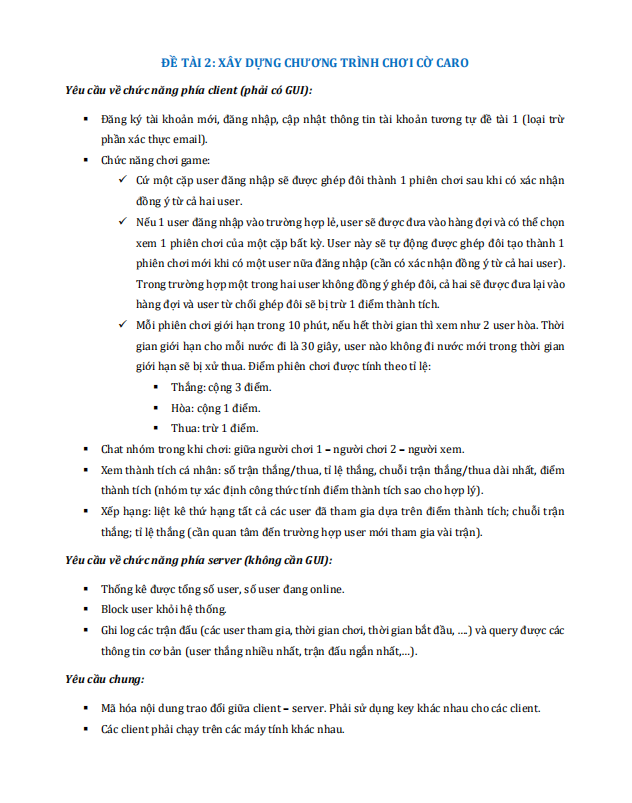

- yêu cầu một vài chỗ có vẻ không thân thiện người dùng như việc tự ghép trận, tự xem trận khi vào game ... nên mình đã làm khác tí, là tạo chức năng tìm trận và ghép cặp riêng với chức năng xem trận, người dùng sẽ có thể lựa chọn theo sở thích.

## 2. Cài đặt

Hướng dẫn setup:
- Cài mysql (mình dùng xampp), IDE (mình dùng Netbean 8.2)
- Thêm cơ sở dữ liệu [src/Server/DB/carodb.sql](src/Server/DB/carodb.sql) vào mysql, đặt tên csdl là "carodb"
- Chạy Server [src/Server/RunServer.java](src/Server/RunServer.java) mặc định sẽ chạy ở port  5056
- Chạy Client [src/Client/RunClient.java](src/Client/RunClient.java)
- Giao diện Connect Server hiện lên. Nhập IP, port tới Server (mặc định mình đã ghi sẵn ip server local rồi)
- Ấn Kết nối và Chơi

## 3. Screenshots

### Server

#### - Admin Console

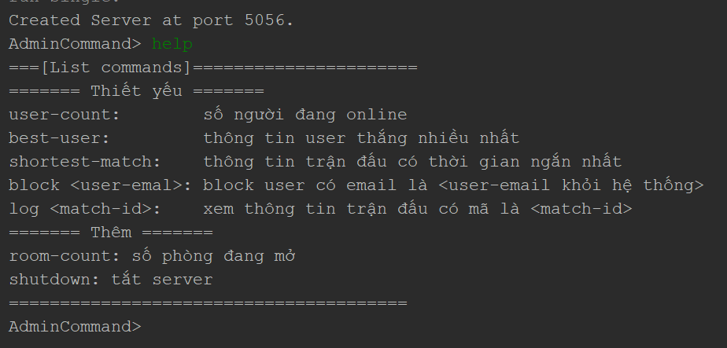

### Client

#### - Connect to server

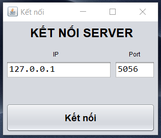

#### - Login

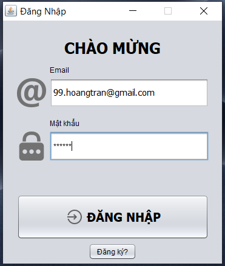

#### - Signup

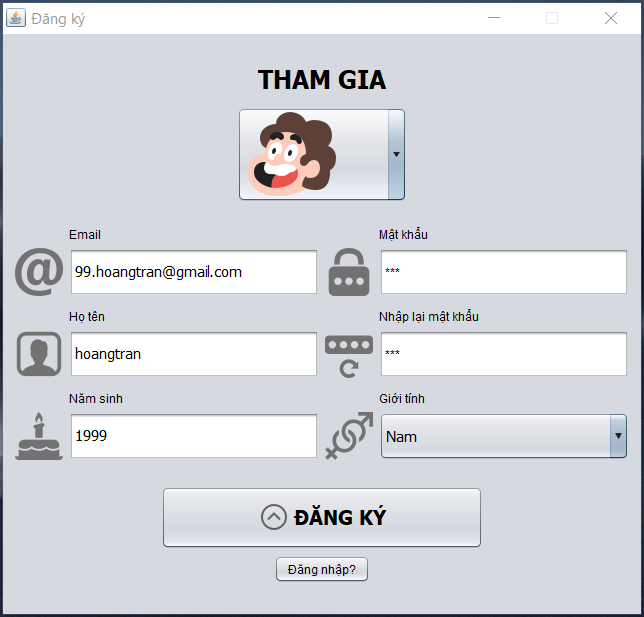

#### - Select custom avatar

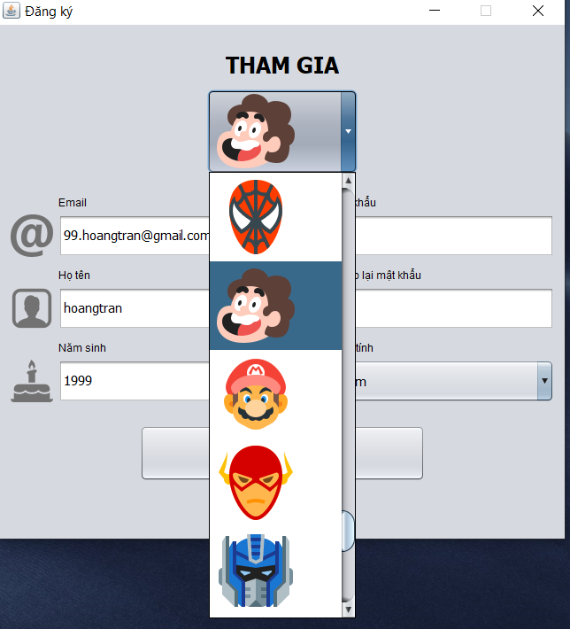

#### - Main menu

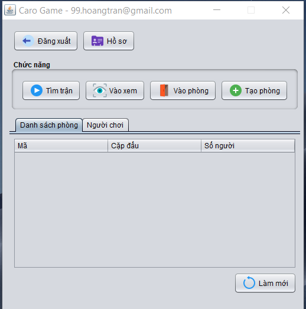

#### - Profile

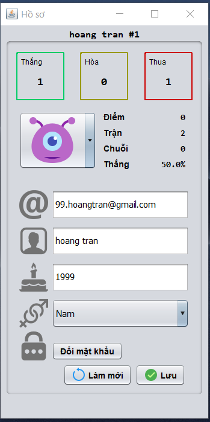

#### - Find game match

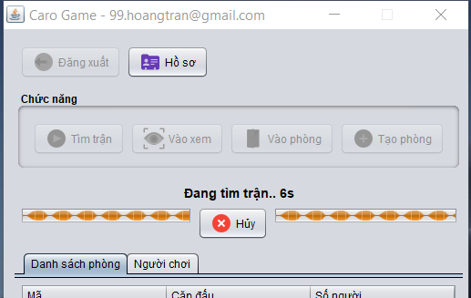

#### - Pair game match

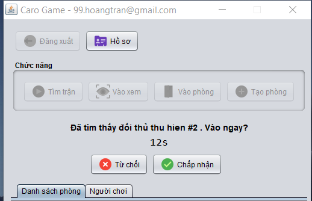

#### - In-game  Caro

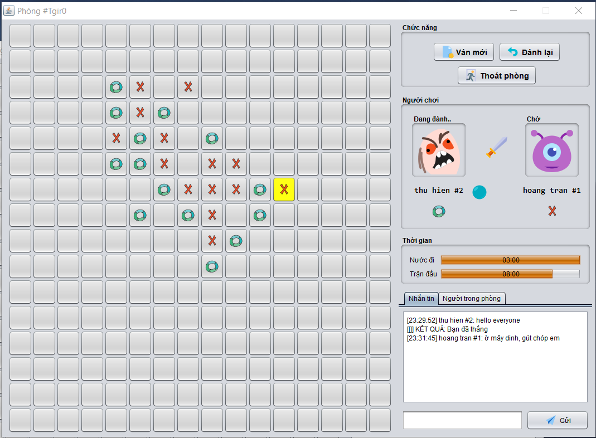

#### - In-game Caro right panel

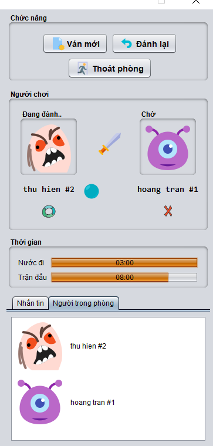
